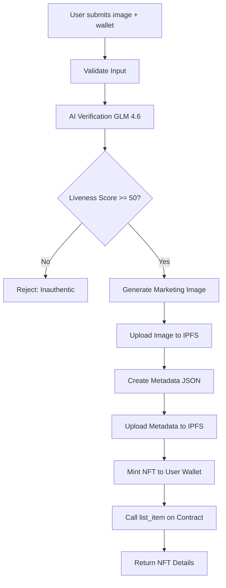

# HypeChain Implementation Summary

## ✅ Complete Implementation

All components have been successfully implemented for the HypeChain NFT marketplace with AI verification.

---

## 📂 Files Created

### Frontend Application (`/frontend`)

#### 1. **API Route Handler**
**File**: `src/app/api/create-listing/route.ts`

Main endpoint that orchestrates the entire listing creation process:
- Validates user input (wallet address, image)
- Calls AI verification service
- Generates marketing images
- Uploads to IPFS
- Mints NFT on Solana
- Lists on marketplace contract

**Methods**: `POST`, `GET`

#### 2. **Services Layer**

**a) OpenRouter Service** (`src/services/openrouter.ts`)
- `verifyProduct()` - AI product verification using GLM 4.6 vision
- `generateMarketingImage()` - AI image generation with crypto backgrounds
- `downloadImageAsBase64()` - Downloads generated images

**b) IPFS Service** (`src/services/ipfs.ts`)
- `uploadImageToIPFS()` - Uploads images to IPFS via nft.storage
- `uploadMetadataToIPFS()` - Uploads NFT metadata JSON
- `createAndUploadNFTMetadata()` - Complete metadata creation pipeline
- `checkIPFSStatus()` - Health check

**c) Solana Service** (`src/services/solana.ts`)
- `mintNFT()` - Mints NFT using Metaplex Umi SDK
- `listItemOnMarketplace()` - Calls smart contract to list item
- `validateNFTOwnership()` - Verifies wallet owns NFT
- `getBalance()` - Checks SOL balance
- `requestAirdrop()` - Devnet SOL airdrop

#### 3. **Utilities**

**File**: `src/utils/validation.ts`
- `isValidSolanaPublicKey()` - Validates Solana addresses
- `validateBase64Image()` - Validates image format and size
- `base64ToFile()` - Converts base64 to File object
- `base64ToBuffer()` - Converts base64 to Buffer

#### 4. **Types**

**File**: `src/types/listing.ts`

TypeScript interfaces for:
- API requests/responses
- Product verification data
- NFT metadata
- Marketplace listings

#### 5. **Configuration**

**Files**:
- `package.json` - Updated with all required dependencies
- `.env.example` - Environment variable template

---

### Smart Contract (`/contracts`)

#### 1. **Anchor Program**

**File**: `programs/hypechain-marketplace/src/lib.rs`

Complete Solana smart contract with:

**Instructions**:
- `list_item` - Lists an NFT with price
- `delist_item` - Removes listing (seller only)
- `buy_item` - Purchases NFT, transfers SOL and NFT

**Account Structures**:
- `ProductListing` - Stores listing data in PDA

**Error Handling**:
- `UnauthorizedSeller`
- `ItemNotListed`
- `InsufficientFunds`
- `InvalidNFTMint`

**Security Features**:
- Seller verification
- Ownership checks
- PDA seeds validation
- Safe SOL/NFT transfers

#### 2. **Anchor Configuration**

**Files**:
- `Anchor.toml` - Project configuration
- `programs/hypechain-marketplace/Cargo.toml` - Rust dependencies
- `programs/hypechain-marketplace/Xargo.toml` - Build configuration
- `package.json` - NPM scripts for deployment

---

## 🔄 Complete Flow

### Creating a Listing



### Step-by-Step Process

1. **Validation** (Pre-Step)
   - Validates Solana wallet address format
   - Checks image is valid base64, max 5MB
   - Verifies image format (JPEG/PNG/WebP)

2. **AI Verification** (Step 1)
   - Sends image to GLM 4.6 vision model
   - Analyzes brand, model, colorway
   - Calculates liveness score (0-100)
   - Extracts visible identifiers
   - Creates full description
   - **Rejects if liveness < 50**

3. **Image Generation** (Step 2)
   - Uses full description as prompt
   - Generates 1024x1024 marketing image
   - Adds Solana-themed background
   - Downloads as base64
   - **Retries once on failure**

4. **IPFS Upload** (Step 3)
   - Uploads generated image → get CID
   - Creates metadata JSON with attributes
   - Uploads metadata → get URI
   - Returns IPFS URLs

5. **NFT Minting** (Step 4)
   - Uses Metaplex Umi SDK
   - Server wallet pays fees
   - NFT minted to user's wallet
   - Sets 5% royalty
   - Returns mint address

6. **Marketplace Listing** (Step 5)
   - Calls `list_item` instruction
   - Creates PDA for listing
   - Stores price, seller, mint
   - Sets `is_listed = true`

---

## 📦 Dependencies Added

### Frontend (`package.json`)

```json
{
  "@metaplex-foundation/mpl-token-metadata": "^3.2.1",
  "@metaplex-foundation/umi": "^0.9.2",
  "@metaplex-foundation/umi-bundle-defaults": "^0.9.2",
  "@solana/web3.js": "^1.95.8",
  "bs58": "^6.0.0",
  "nft.storage": "^7.2.0",
  "openai": "^4.72.0"
}
```

### Smart Contract (`Cargo.toml`)

```toml
anchor-lang = "0.30.1"
anchor-spl = "0.30.1"
```

---

## 🔐 Environment Variables Required

Create `frontend/.env.local`:

```bash
# Required for AI verification and image generation
OPENROUTER_API_KEY=sk-or-...

# Required for IPFS uploads
NFT_STORAGE_API_KEY=eyJhb...

# Solana configuration
SOLANA_RPC_URL=https://api.devnet.solana.com
SOLANA_NETWORK=devnet

# Server wallet (pays for minting fees)
# Generate with: solana-keygen new
SERVER_WALLET_PRIVATE_KEY=base58_encoded_private_key

# After deploying contract
MARKETPLACE_PROGRAM_ID=Fg6PaFpoGXkYsidMpWTK6W2BeZ7FEfcYkg476zPFsLnS
```

---

## 🚀 Deployment Steps

### 1. Install Dependencies

```bash
# Frontend
cd frontend
bun install

# Contracts (if building locally)
cd ../contracts
# Ensure Rust and Anchor are installed
anchor build
```

### 2. Set Up Environment

```bash
# Copy example env
cp frontend/.env.example frontend/.env.local

# Edit with your keys
nano frontend/.env.local
```

### 3. Deploy Smart Contract

```bash
cd contracts

# Build
anchor build

# Deploy to devnet
anchor deploy --provider.cluster devnet

# Copy the Program ID output and add to .env.local
```

### 4. Run Frontend

```bash
cd frontend
bun dev
```

The API will be available at `http://localhost:3000/api/create-listing`

---

## 🧪 Testing the API

### Using cURL

```bash
# First, create a base64 encoded image
# Example: Take a photo of sneakers and convert to base64

curl -X POST http://localhost:3000/api/create-listing \
  -H "Content-Type: application/json" \
  -d '{
    "userWallet": "YourSolanaPublicKeyHere",
    "productImage": "data:image/jpeg;base64,/9j/4AAQSkZJRg...",
    "optionalPriceSol": 0.5
  }'
```

### Using JavaScript

```javascript
const response = await fetch('/api/create-listing', {
  method: 'POST',
  headers: { 'Content-Type': 'application/json' },
  body: JSON.stringify({
    userWallet: 'ABC123...',
    productImage: 'data:image/jpeg;base64,...',
    optionalPriceSol: 1.0
  })
});

const result = await response.json();
console.log(result);
// {
//   success: true,
//   nft_mint_address: "...",
//   nft_image_url: "https://nftstorage.link/ipfs/...",
//   product_name: "Nike Air Jordan 1",
//   listing_price_sol: 1.0
// }
```

---

## 📊 API Response Examples

### Success Response

```json
{
  "success": true,
  "nft_mint_address": "9xQeWvG816bUx9EPjHmaT23yvVM2ZWbrrpZb9PusVFin",
  "nft_image_url": "https://nftstorage.link/ipfs/bafybeigdyrzt5sfp7udm7hu76uh7y26nf3efuylqabf3oclgtqy55fbzdi",
  "product_name": "Nike Air Jordan 1 High OG Chicago",
  "listing_price_sol": 0.5
}
```

### Error Responses

**Invalid Wallet**:
```json
{
  "success": false,
  "error": "Invalid Solana wallet address"
}
```

**Low Liveness Score**:
```json
{
  "success": false,
  "error": "Image appears inauthentic: Flat appearance with pixelation indicates screenshot"
}
```

**Image Too Large**:
```json
{
  "success": false,
  "error": "Image size (6.2MB) exceeds maximum of 5MB"
}
```

---

## 🔧 Smart Contract Interactions

### List an Item (After Minting)

The API automatically calls this, but you can also call directly:

```typescript
import * as anchor from "@coral-xyz/anchor";

const tx = await program.methods
  .listItem(new anchor.BN(priceInLamports))
  .accounts({
    seller: sellerPublicKey,
    nftMint: nftMintAddress,
    productListing: listingPda,
    systemProgram: SystemProgram.programId,
  })
  .rpc();
```

### Buy an Item

```typescript
const tx = await program.methods
  .buyItem()
  .accounts({
    buyer: buyerPublicKey,
    sellerAccount: sellerPublicKey,
    nftMint: nftMintAddress,
    productListing: listingPda,
    sellerTokenAccount: sellerTokenAccountAddress,
    buyerTokenAccount: buyerTokenAccountAddress,
    tokenProgram: TOKEN_PROGRAM_ID,
    systemProgram: SystemProgram.programId,
  })
  .rpc();
```

### Delist an Item

```typescript
const tx = await program.methods
  .delistItem()
  .accounts({
    seller: sellerPublicKey,
    nftMint: nftMintAddress,
    productListing: listingPda,
  })
  .rpc();
```

---

## 📝 Key Implementation Details

### AI Verification Response Schema

The GLM 4.6 model returns structured JSON:

```typescript
{
  product_identification: {
    brand: "Nike",
    model: "Air Jordan 1 High OG",
    colorway: "Chicago",
    confidence: "high"
  },
  liveness_check: {
    liveness_score: 85,
    reason: "Strong 3D shadows and realistic textures suggest physical item"
  },
  visible_identifiers: {
    serial_numbers: ["854717-061"],
    tags: ["Nike tag visible on tongue"]
  },
  full_description: "Nike Air Jordan 1 High OG Chicago in original box, size 10, excellent condition with minor wear on sole"
}
```

### NFT Metadata Structure

Stored on IPFS:

```json
{
  "name": "Nike Air Jordan 1 High OG Chicago",
  "description": "Authentic Nike Air Jordan 1 verified and minted on Solana...",
  "image": "ipfs://bafybei...",
  "attributes": [
    {"trait_type": "Brand", "value": "Nike"},
    {"trait_type": "Model", "value": "Air Jordan 1 High OG"},
    {"trait_type": "Colorway", "value": "Chicago"},
    {"trait_type": "Liveness Score", "value": 85},
    {"trait_type": "Verification Confidence", "value": "high"}
  ]
}
```

### Smart Contract PDA

Listing accounts are PDAs derived from:

```rust
seeds = [b"product_listing", nft_mint.as_ref()]
```

This ensures one listing per NFT mint.

---

## 🎯 Next Steps

### Immediate
1. Set up API keys (OpenRouter, NFT.Storage)
2. Generate server wallet and fund with devnet SOL
3. Deploy smart contract to devnet
4. Test API with sample product images

### Future Features
- Frontend UI for creating listings
- Browse/search marketplace page
- User profiles and collections
- Auction functionality
- Offer system
- Analytics dashboard

---

## 🐛 Troubleshooting

### "OPENROUTER_API_KEY is not set"
- Add key to `frontend/.env.local`
- Restart dev server

### "NFT minting error"
- Check SERVER_WALLET_PRIVATE_KEY is valid base58
- Ensure wallet has SOL on devnet
- Use `solana airdrop 2` to get devnet SOL

### "Image generation failed"
- Check OpenRouter credits/quota
- Verify model name is correct: `zhipuai/glm-4-plus`

### "IPFS upload error"
- Verify NFT_STORAGE_API_KEY is valid
- Check internet connection
- NFT.Storage may be rate limiting

---

## 📞 Support Resources

- **Anchor Documentation**: https://www.anchor-lang.com/
- **Metaplex Docs**: https://developers.metaplex.com/
- **Solana Cookbook**: https://solanacookbook.com/
- **OpenRouter API**: https://openrouter.ai/docs
- **NFT.Storage**: https://nft.storage/docs/

---

Built for **HackNYU 2025** 🚀

Complete implementation ready for deployment and testing!
